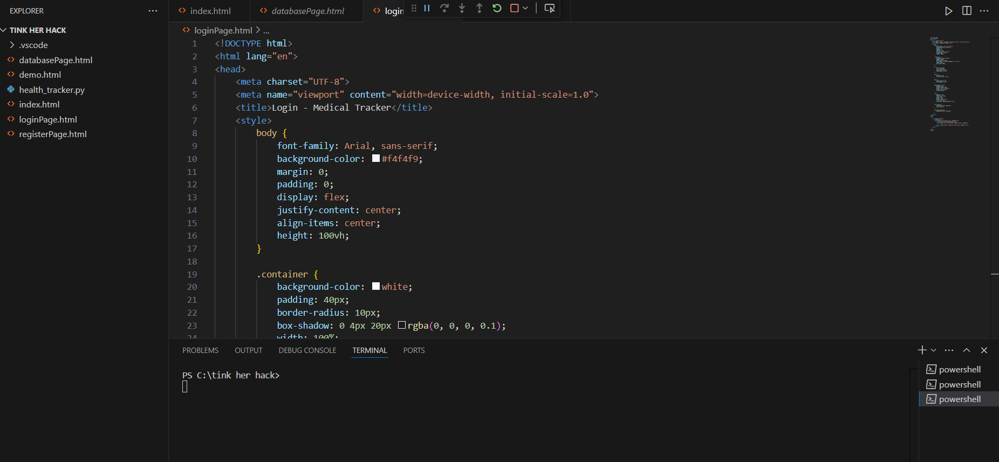
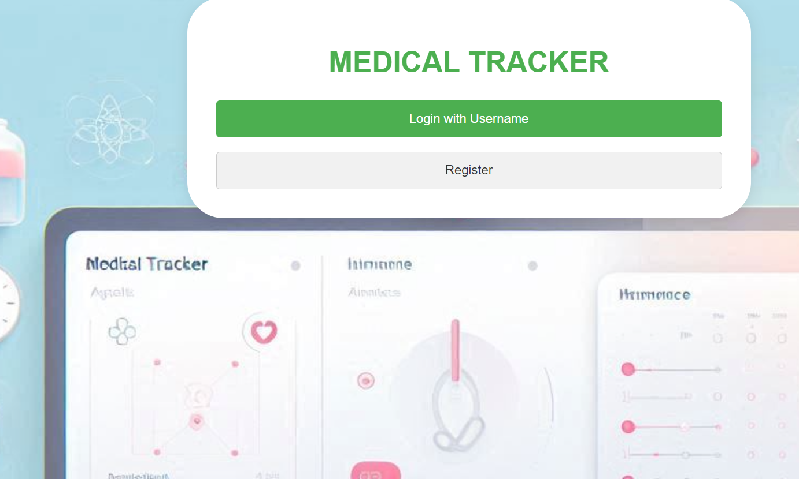
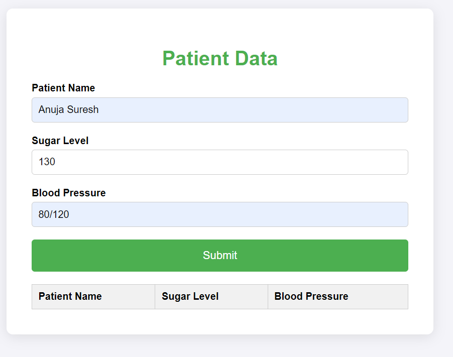

# MEDICAL RECORDER
🎯

## KEEPS RECORD OF YOUR MEDICAL RECORDS
### Team Name MATRIX

### Team Members
- Member 1: DIVA D KARAN - CEA
- Member 2: ANUJA SURESH - CEA
  

### Hosted Project Link
https://medicaltracker.vercel.app

### Project Description
IT STORES DETILS OF MEDICAL RECORDS

### The Problem statement
TO MONITOR HEALTH CONDITION

### The Solution
KEEPING TRACK O F YOUR TEST RESULTS

## Technical Details
### Technologies/Components Used
For Software:
 HTML
 CSS
 VSCODE

For Hardware:
- NO

### Implementation
For Software:
# Installation

# Run
[commands]

### Project Documentation
For Software:

# Screenshots (Add at least 3)

*Add caption explaining what this shows*

*Add caption explaining what this shows*

*Add caption explaining what this shows*

# Diagrams

*Add caption explaining your workflow*

For Hardware:

# Schematic & Circuit

*Add caption explaining connections*

*Add caption explaining the schematic*

# Build Photos

*List out all components shown*

*Explain the build steps*

*Explain the final build*

### Project Demo
# Video
https://drive.google.com/file/d/1GJZ1LCSSv9e8mDSjK8PgrMtaWW_AmRLh/view?usp=drive_link
*Explain what the video demonstrates*

# Additional Demos
[Add any extra demo materials/links]

## Team Contributions
- [Name 1]: [Specific contributions]
- [Name 2]: [Specific contributions]
- [Name 3]: [Specific contributions]

---
Made with ❤️ at TinkerHub
